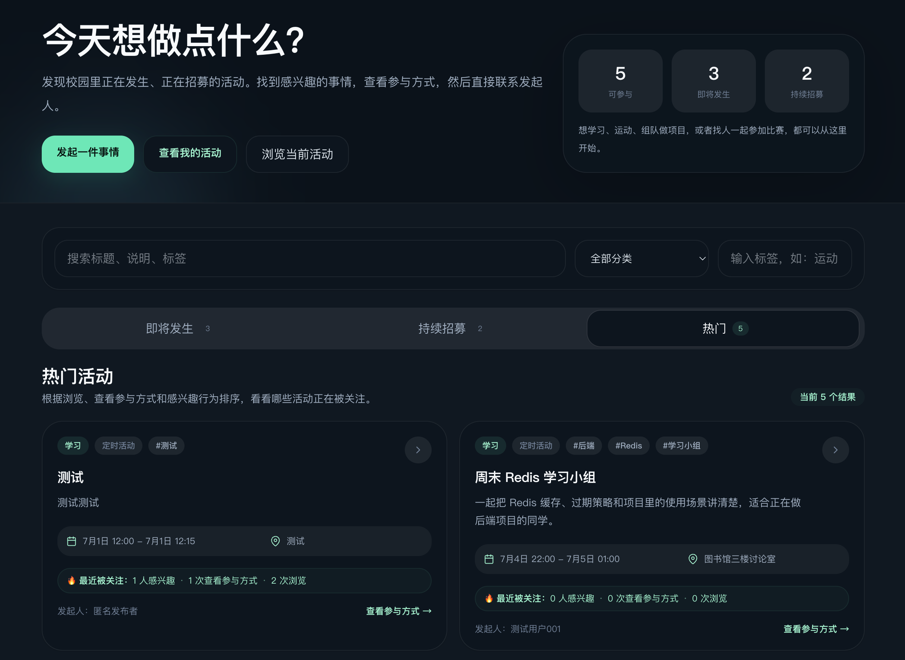
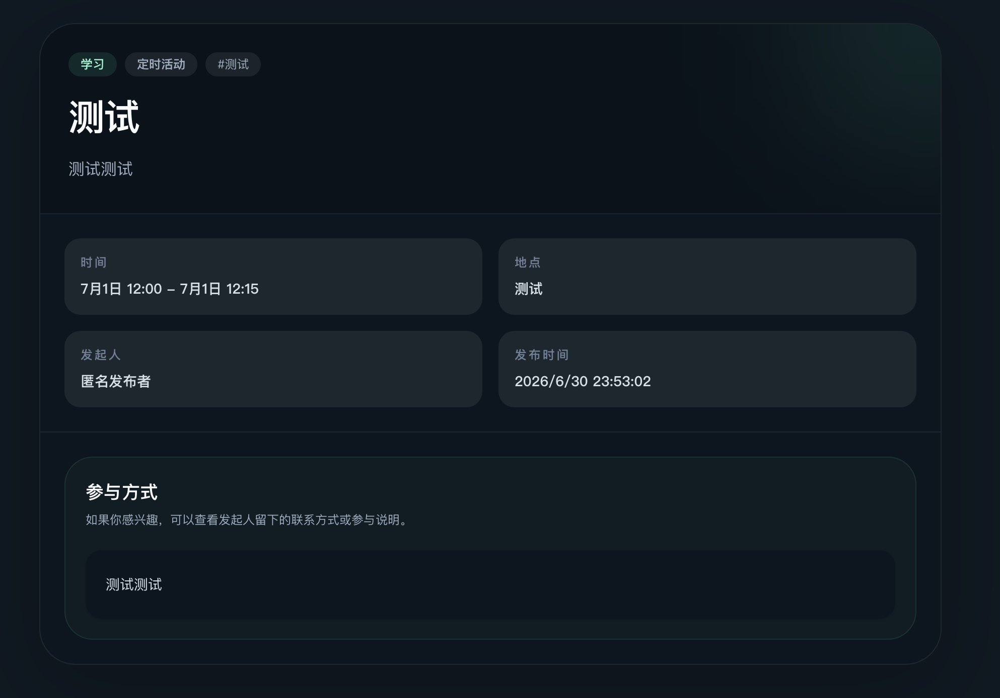

# do-together

[English README](README.md)

**do-together** 是一个 Activity-first 的校园参与平台，帮助学生发现校园里值得一起做的事情，让这些事情不再只散落在微信群、朋友圈、招新季和熟人转发里。

## 当前状态

- Activity-first MVP 已实现并完成手动验收。
- Docker Compose 部署已完成。
- VPS 公网访问验收已通过。
- 当前验收重点是 Activity 发现、参与方式查看、Interest 表达和 Activity Update 通知。

## 为什么做这个项目

校园里不缺有趣的人。
也不缺值得一起做的事情。

缺的是一个能让这些事情在离开微信群、朋友圈、招新季和熟人圈之后，仍然持续可发现的地方。

第一版验证一个产品问题：

> 如果校园里有一个持续开放的地方，让任何人都能发布值得一起做的事情，会不会有人发现它，并真的参与？

## MVP 主链路

```text
login
→ Activity Feed
→ search / filter Activities
→ Activity Detail
→ view participation method
→ express Interest
→ receive Activity Update notification
→ publish Activity
→ manage my initiated Activities
```

当前 MVP 验证的是：用户能否发现一个 Activity，理解它为什么值得参加，看到参与方式，私下联系发起者，并在之后继续回来发现新的事情。

## 已实现功能

- 用户登录
- Activity Feed：`Upcoming` / `Ongoing` / `Hot`
- Activity 搜索、分类筛选、标签筛选
- Activity Detail
- 自由文本参与方式 participationMethod
- Activity Interest
- Activity Updates / 活动补充说明
- Interest / Activity Update 在线提示
- 我的发布
- 关闭自己发布的 Activity

## MVP 不做什么

当前 MVP 刻意不做：

- 组织系统
- 组织主页
- 加入组织 / Membership
- 平台内报名系统
- 多频道聊天
- 实时聊天
- 通知中心
- 推荐算法
- 评论系统
- 文件 / 图片上传

仓库里仍然存在历史的 organization、channel、chat 代码。它们是历史实现资产和未来可能能力，不是当前产品验收主链路。

## 截图

### Activity 发现首页

Activity Feed 展示第一屏发现路径：发起 Activity、查看我的发布、浏览当前 Activities、按标题/说明/标签搜索、按分类/标签筛选，并在 Upcoming、Ongoing、Hot 之间切换。



### Activity Detail 和参与方式

Activity Detail 页面保留用户做参与决策需要的信息：这是什么 Activity、什么时候发生、在哪里发生、由谁发起，以及感兴趣的用户如何通过 participation method 私下/off-platform 跟进。



## 技术栈

| 层级 | 技术 |
| --- | --- |
| Frontend | React, TypeScript, Vite, Nginx |
| Backend | Spring Boot, Java 21, MyBatis |
| Database | MySQL 8.4 |
| Cache / Ranking / Rate Limit | Redis |
| Async Notification | RabbitMQ |
| Deployment | Docker Compose, VPS |

## 工程亮点

### Activity-first 领域建模

项目从聊天室练习重构为 Activity-first 的校园参与平台。当前产品模型围绕 Activity 发现、参与方式、Interest 和 Activity Updates 展开。

### Redis 支撑发现与保护机制

Redis 用于：

- Hot Activity Ranking；
- 公共行为限流；
- Activity 过期时间索引。

MySQL 仍然是 Activity 可见性、状态和持久化记录的 source of truth。

### RabbitMQ 处理异步副作用

Interest 和 Activity Update 通知被设计为异步副作用处理，不阻塞核心 Activity 流程。

### Docker Compose 部署

frontend、backend、MySQL、Redis、RabbitMQ 被容器化，并作为一个部署单元启动。

### VPS 公网验收

当前 MVP 已部署到 VPS，并通过公网 Activity-first 主链路完成手动验收。

## 架构

```text
Browser
  ↓
Frontend container / Nginx :80
  ├─ serves React static assets
  ├─ proxies /api/* → backend:8080
  └─ proxies /ws/*  → backend:8080

Backend / Spring Boot
  ├─ MySQL    source of truth
  ├─ Redis    hot ranking, rate limiting, expiration index
  └─ RabbitMQ async notification side effects
```

## 快速启动

```bash
cp .env.deploy.example .env.deploy
docker compose --env-file .env.deploy up -d --build
```

打开：

```text
http://localhost:3000
```

查看服务：

```bash
docker compose --env-file .env.deploy ps
```

重置本地数据：

```bash
docker compose --env-file .env.deploy down -v
docker compose --env-file .env.deploy up -d --build
```

## 测试账号

使用本地开发 override 时，会初始化以下账号：

| Username | Password | Role | 用途 |
| --- | --- | --- | --- |
| `admin` | `123456` | ADMIN | 管理 / 部署验证 |
| `test001` | `123456` | MEMBER | Activity 浏览者 / 发起者 |
| `test002` | `123456` | MEMBER | 第二浏览者 / 发起者 |

`docker-compose.override.yml` 会加入开发 seed 数据。真实生产部署不要直接这样使用。

## 本地冒烟测试

登录：

```bash
curl -s -X POST 'http://localhost:3000/api/auth/login' \
  -H 'Content-Type: application/json' \
  -d '{"username":"test001","password":"123456"}'
```

带 token 拉取 Activities：

```bash
TOKEN=$(curl -s -X POST 'http://localhost:3000/api/auth/login' \
  -H 'Content-Type: application/json' \
  -d '{"username":"test001","password":"123456"}' \
  | python3 -c "import sys,json; print(json.load(sys.stdin)['token'])")

AUTH_HEADER=$(printf 'Authorization: \x42earer %s' "$TOKEN")

curl -s 'http://localhost:3000/api/activities' \
  -H "$AUTH_HEADER"
```

## 开发模式

Backend：

```bash
cd backend
mvn -q -DskipTests compile
mvn spring-boot:run
```

Frontend：

```bash
cd frontend
npm run build
npm run dev
```

## 部署

项目支持 Docker Compose 部署。

```bash
cp .env.deploy.example .env.deploy
# edit secrets in .env.deploy
docker compose --env-file .env.deploy up -d --build
```

VPS 部署步骤和验收清单见：[docs/deployment.md](docs/deployment.md)。

VPS 公网访问验收已经通过。公开 URL 不写入仓库文档。

## 文档

- [VISION.md](VISION.md) — 产品愿景
- [docs/MVP.md](docs/MVP.md) — 当前 MVP 范围
- [docs/adr/0003-activity-first-mvp.md](docs/adr/0003-activity-first-mvp.md) — Activity-first 产品决策
- [CONTEXT.md](CONTEXT.md) — 领域词汇和当前上下文
- [docs/api-contract.md](docs/api-contract.md) — API 契约
- [docs/manual-acceptance.md](docs/manual-acceptance.md) — 手动验收指南
- [docs/deployment.md](docs/deployment.md) — Docker/VPS 部署
- [docs/roadmap.md](docs/roadmap.md) — 当前状态和后续方向
- [DOCUMENTATION.md](DOCUMENTATION.md) — 完整文档地图
- [docs/archive/](docs/archive/) — 历史文档
